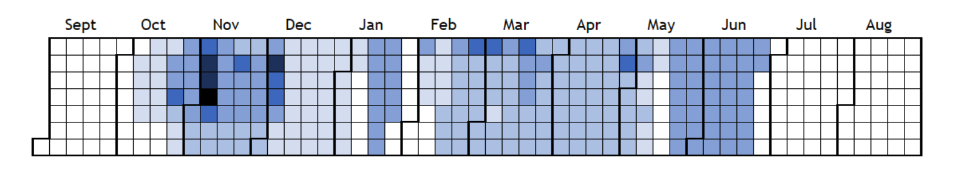

# Heatmap Calendars

A prototype web application developed for Newcastle University: School of Biology and School of Marine Science/Technology. Used for displaying workload levels for students and members of staff through data visualisation techniques.

Please note: I developed this while I was still a CS student. There _will_ be some antipatterns and optimisations that can be made! Please check the [User Guide](./docs/user-guide.md) and [Technical Description](./docs/technical-description.md) for more details.

## Folder structure

The application uses a Model View Controller architecture (please see the Technical Description for further details).
Application files are located in the 'app' directory.
Public resources, such as CSS, JavaScript and images are located in the 'public' directory.

### app/controller

Contains all controllers that map URL locations to PHP functions.

### app/core

Contains the initialisation file specifying the base URL, database config details and allows users to log in with cookies.

### app/libs

Contains library classes, acting as system components and wrapper classes.

### app/model

Contains all business logic for the program; interacts with the database and returns values to the controller(s).

### app/views

Contains markup templates i.e. the presentation layer of the system.

## Installing the application

You will need domain hosting which can accept .htaccess files, and a MySQL database.

### 1. Transfer all files to your web root

Make sure this file has been unzipped/decompressed and copy everything to your root folder. If you're using a linux server, make sure the appropriate permissions have been changed using 'chmod': ensure all files in the 'app' directory are read only by you and the system (NOT others); files in the 'public' directory can be read-only by everyone.

### 2. Create a MySQL database and execute every query in app/setup/initialSQL.sql

In your database schema, run all the SQL queries in initialSQL.sql.
This sets up all the system and application tables you'll need to run the application, including setup access accounts.
This file also contains sample data for the academic year of 2013-2014 - your users will need to provide data for other years, which you could load directly as SQL queries to your database, or users could input this information manually via the application interface.

### 3. Change the database connection credentials in app/core/init.php

Change the 'mysql' details in the array as follows:
'host' => '[your host name, e.g. homepages.cs.ncl.ac.uk]',
'username' => '[your database user name: this could be your staff/student id]',
'password' => [your MySQL database password: please make sure it is DIFFERENT to your CAMPUS PASSWORD!],
'db' => '[your database schema name: this could be the same as your staff/student id]'

### 4. Access the website as 'setup_admin' and create new users (at least one should be an administrator account)

Create new administrator, power user and standard user accounts as you require.
Administrator accounts can manage all user accounts (including other administrators) and also have power user rights as well.
Power users can manage application data and create new users and have standard user rights as well.
Standard users can only create module combinations, view calendars and change their account password.

### 5. Log back in as the new administrator and delete 'setup_admin', 'setup_power' and 'setup_user'

You should delete these accounts because they use the default password: 'password'.
Access the data management page 'Manage User Accounts' and click the dustbin icon to remove the accounts.

## Updates

### Version 1.1 updates

Colour scale in public/style.css increased
Unit testing for user registration added
Salt string in app/libs/Hash.php updated for more convenient MySQL storage

### Version 1.2 updates

OpenSSL random pseudo bytes replaced with mcrypt_create_iv function to generate salt

### Version 1.3 updates

MINI Framework replaced with TINY framework as mod_rewrite is not enabled on teaching.ncl.ac.uk
Note: the framework folder structure for this application and the tiny framework differ
