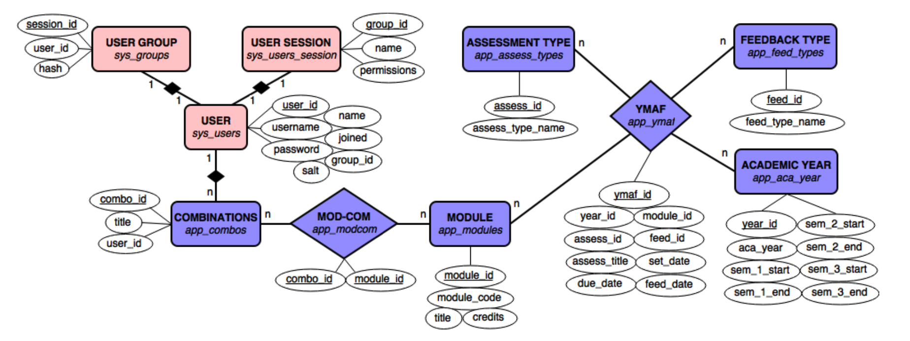

# Technical Description (converted from PDF)

AFWC: assessment and feedback workload calendars

## Contents

1. Description
2. Technologies, languages and libraries 2.1. PHP
   2.2. MySQL
   2.3. HTML / CSS 2.4. JavaScript
   2.4.1. jQuery
   2.4.2. Ajax
   2.4.3. Data-Driven Documents (d3.js) 2.4.4. EditableGrid
3. System structure
   3.1. Model View Controller framework 3.2. Object-oriented login system
   3.3. The ‘WorkloadCalendarView’ object
4. Data
   4.1. Entity-Relationship diagram
   4.2. User operations for remote database management
5. Installation
6. Future considerations
   6.1. Importing and exporting data
   6.2. Accommodating module credits and assignment weighting

## 1. Description

AFWC is a data visualisation tool that allows users to create assessment data with set dates, due dates and feedback due dates, associate assessments with modules and display the workload levels for students taking specific modules, or staff members assessing modules.

## 2. Technologies, languages and libraries

The web application uses PHP as the system framework, a MySQL database to store the data, and a combination of HTML, CSS and JavaScript for the presentation component. The use of JavaScript draws on the jQuery library, Ajax for HTTP updates, d3.js for visualisations and EditableGrid for straightforward data viewing and editing. The diagram below broadly shows how these technologies interact with each other and how they are grouped.

### 2.1 PHP

PHP is a server-side scripting language, used to handle user sessions, connect to and retrieve data from a database, as well as generate content templates in response to user activity. This the language used by the application itself: users should not see any raw PHP, but should instead see HTML, CSS and JavaScript generated by templates.

https://www.php.net/

### 2.2 MySQL

MySQL is a popular open-source database management solution that can be administered from the command-line, or a GUI tool such as MySQL Workbench or phpMyAdmin. It is widely supported by many website/database hosting services, including Newcastle University, and allows languages such as PHP, Python and Perl to connect to and query its databases.

https://www.mysql.com/

### 2.3 HTML / CSS

Hypertext Markup Language defines the semantic structure of web documents. While it does support style tags to define aesthetic properties of web pages, and script tags to define application behaviour, an effort should be made to keep these separate. Web document styling can (and should) be factored out to Cascading Style Sheets, which reference elements of the web document using ‘CSS Selectors’.

### 2.4 JavaScript

JavaScript is a programming language that allows web documents to respond to user events and update DOM elements. Examples of this include clicking on table cell values to change the value stored in the database, or producing a calendar view of data with new user requests. General event handling functions are defined in ‘DataMgtHander.js’, ‘DragDropHandler.js’ and ‘VisualisationHandler.js’. Specific libraries are contained in minified code, such as ‘d3.min.js’ and ‘jquery-1.11.3.min.js’. All JavaScript files are contained in the ‘public’ directory under ‘js’.

### 2.4.1 jQuery

JQuery is a JavaScript library that simplifies event handling, performing actions when the document loads, manipulating DOM elements and inserting new ones (e.g. inserting a table of modules below a calendar). It further provides support for dragging and dropping list elements to create module combinations.

https://jquery.com/

### 2.4.2 Ajax

Ajax allows HTTP requests to be sent and received from JavaScript functions without the need to refresh the browser. This is used when cell values are updated or new entries are created/deleted in the data management section of the site. Ajax is facilitated by the jQuery library and also allows the ‘WorkloadCalendarView’ object to send requests to the server for new assessment (YMAF) data.

### 2.4.3 Data-Driven Documents (d3.js)

D3.js is a JavaScript library that is used to generate the Workload Calendar visualisations. Its commands are contained within the ‘WorkloadCalendarView.js’ object and dynamically draws SVG shapes based on data received from the server. Workload Calendar View is an adaptation of ‘Calendar View’ by M. Bostock, modified for the academic year and for handling assessment data.

http://d3js.org/
http://bl.ocks.org/mbostock/4063318

### 2.4.4 EditableGrid

EditableGrid is an open-source JavaScript and PHP extension that allows HTML tables to be directly modifiable by users. When components are edited, an Ajax request is sent by the Data Management Handler (DataMgtHandler.js) to the server to change the value stored in the database. On success, the table row will flash green, on failure it will flash red. Data is loaded by the EditableGrid class in JSON format. The JavaScript object allows the table columns to sort the data in ascending/descending order, provide paginator controls and filters for large amounts of data.

http://www.editablegrid.net/en/
https://github.com/jybeaujean/editablegrid-mysql-example

## 3. System structure

There are two main directories for the application: ‘app’, which contains all of the PHP application logic, and ‘public’, which contains CSS, images, and JavaScript files. When a user visits index.php, the initialisation script (app/core/init.php) is called, which defines the base URL of the website, establishes database connection details and loads all of the library classes located in the folder ‘libs’. An Application object is created, which is used to direct URL requests to specific services of the site.

### 3.1 Model View Controller framework

The application uses a Model View Controller framework called ‘MINI’, which is available here:

https://github.com/panique/mini

Please note that the framework has been modified for the needs of the project and does not mirror the author’s framework exactly. The use of MVC can be described as follows:

-   The Client (i.e. the user) sends HTTP requests to the Controller for services. These services are determined by the URL they provide, either directly or by following a specific hyperlink.
-   The Controller scripts take these requests and any user input, such as form data, and determines which classes/methods from the Model scripts to use. The Controller is primarily responsible for handling user input and system output.
-   The Model scripts deal with the ‘business logic’ of the system. These scripts validate user input that has been provided by Controller scripts, retrieve appropriate data stored in the database and return this to the calling scripts as raw or formatted data.
-   Once the data has been returned to the Controller scripts, they are rendered as Views to present the information to the Client. The Views are concerned with the presentation of the requested data/services and is the HTML mark-up, CSS styling and JavaScript that the user actually sees.
-   The Controller and Model scripts will use auxiliary classes, functions and configuration scripts to handle requests and data in an object-oriented manner. Examples of auxiliary classes would include User objects with methods for logging in and out, or a re-usable database connection.

All Model, View, Controller and auxiliary scripts are written in PHP. Separating system actions into these categories allows business logic, input/output handling and presentation to be treat as separate modules. This allows an area such as business logic to be updated in the future, without significantly affecting the presentation layer (for example), which would require View scripts to be heavily modified as well.

### 3.2 Object-oriented login system

Object-oriented login system by Alex Garrett of PHP Academy. Video tutorials available through YouTube from this playlist:

https://youtu.be/c_hNNAdyfQk?list=PLfdtiltiRHWF5Rhuk7k4UAU1_yLAZzhWc

The library classes of the tutorial were integrated with the MVC framework.

### 3.3 The ‘WorkloadCalendarView’ object

This object is responsible for taking academic dates, YMAF and module information in JSON format, parsing it and drawing the calendar frame, workload heatmap and table of supplementary information respectively. The Visualisation Handler file should send an Ajax request to the server for this date, then once the response has been received it should instantiate a WorkloadCalendarView object, passing the academic dates as a parameter, call the ‘updateYMAFdata’ method and pass the YMAF data, draw the calendar and draw the table, using information received from the server.

## 4. Data

The application requires a relational database management system (RDBMS) to function. The SQL queries used to create the necessary entities and relationships are described in app/setup/initialSQL.sql. The relationships between entities are shown below in the ER diagram.

### 4.1 Entity-Relationship diagram

### 4.2 User operations for remote database management

To allow users to manage the data without a database administrator, the application provides limited ‘CRUD’ operations: Create, Read, Update, and Delete. These are contained in the Model (app/model/model.php). The following operations have been permitted in the application:

-   Users: administrators can delete user accounts, change their name (not username) and permission level. Power users and administrators can create new users from the Settings page. Administrators may create other administrator or power user accounts, with power users only being able to create other standard users.
-   Years: administrators and power users can modify semester dates only.
-   Modules: administrators and power users can create new modules, delete modules,
    or modify module Titles and Credits. Module codes or IDs cannot be modified: the
    record should be deleted and a new one should be created.
-   Assessment types: administrators and power users can change the Title of the
    assessment type, create new assessment types or delete existing ones.
-   Feedback types: administrators and power users can change the Title of the
    feedback type, create new feedback types or delete existing ones.
-   YMAF data: administrators and power users can create new entries, delete existing
    ones and change any of the cell values apart from the primary key (ID)
-   Module combinations: administrators and power users can delete combinations and change the Title of existing combinations. All users can create modules combinations.

## 5. Installation

You will need domain hosting which can accept .htaccess files, and a MySQL database

Transfer all files to your web root: Make sure this file has been unzipped/decompressed and copy everything to your root folder. If you're using a linux server, make sure the appropriate permissions have been changed using 'chmod': ensure all files in the 'app' directory are read only by you and the system (NOT others); files in the 'public' directory can be read-only by everyone.

Create a MySQL database and execute every query in app/setup/initialSQL.sql: In your database schema, run all the SQL queries in initialSQL.sql. This sets up all the system and application tables you'll need to run the application, including setup access accounts. This file also contains sample data for the academic year of 2013-2014 - your users will need to provide data for other years, which you could load directly as SQL queries to your database, or users could input this information manually via the application interface.

Change the database connection credentials in app/core/init.php: Change the 'mysql' details in the array as follows:

-   'host' => '[your host name, e.g. homepages.cs.ncl.ac.uk]',
-   'username' => '[your database user name: this could be your staff/student id]',
-   'password' => [your MySQL database password, please ensure this is different to
-   'db' => '[your database schema name: this could be the same as your staff/student
    id]'

Access the website as 'setup_admin' and create new users (at least one should be an administrator account): Create new administrator, power user and standard user accounts as you require. Administrator accounts can manage all user accounts (including other administrators) and also have power user rights as well. Power users can manage application data and create new users and have standard user rights as well. Standard users can only create module combinations, view calendars and change their account password.

Log back in as the new administrator and delete 'setup_admin', 'setup_power' and 'setup_user': You should delete these accounts because they use the default password: 'password'. Access the data management page 'Manage User Accounts' and click the dustbin icon to remove the accounts.

## 6. Future considerations

A number of features that were requested by users could not be implemented in the first release of this system due to time constraints. This included importing data from a spreadsheet (CSV file), exporting data from the database into a spreadsheet and accommodation of module credits/assignment weighting for a more accurate representation of student and staff workloads.

### 6.1 Importing and exporting data

This would be important to implement in the next iteration, as administrative handling of assessment / module data is expected to be time consuming. If users are able to maintain spreadsheets with columns that conform to the structure of relations in the database, it would be feasible to allow them to upload CSV files to update modules, assessment or feedback types, YMAF data etc. instead of requiring them to manually input each line of data.

Another option to importing data would be to allow users to export data contained in the database to a CSV file. The application could define what columns to include in the spreadsheet, fetch the appropriate data and loop through each record, inserting data into the file. This could be done for all relations from the Data Management page, or from specific pages such as Modules, YMAF, academic dates etc.

### 6.2 Accommodating module credits and assignment weighting

The current prototype will consider each assignment (YMAF entry) as an equally weighted piece of work. This means that the workload heatmap risks being unrepresentative of expected effort for certain pieces of work, for example, a handful of lab reports that may be worth a small percentage of an overall module is considered the same amount of work by the system as the same number of exams, which may form the majority of the marks for a given module. In this case, it would be preferable if the exams appear on the workload calendar in a more saturated colour than the lab reports.

There may be 2 ways to do this: either the Model could return an array of objects and calculate a ‘workload score’ based on SQL queries, returning this data to the WorkloadCalendarView object to use directly; alternatively the module and assignment weighting could be passed to the calendar object and the calculations performed within the object itself. It would be ideal to let JavaScript to the calculations, as this would be performed on the client’s computer, rather than the server and reducing the load on the server at a given time.
