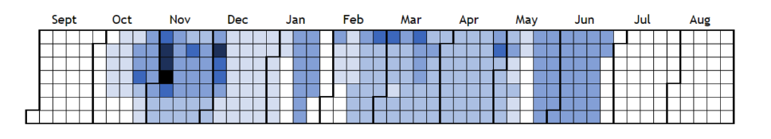

# User Guide (converted from PDF)

AFWC: assessment and feedback workload calendars

## What does AFWC do?

AFWC provides a visualisation of workload levels for students and members of staff. For students, it uses the assessment set date and due date to calculate the number of days that they have to complete the work, and increases the ‘workload value’ for each day. When there are overlapping assignments, the ‘workload value’ for those days will be higher. Below is an example of the calendar visualisation, which shows days with higher workload values in a more saturated colour than other days.

Staff workload visualisations work in a similar manner, using the range of days between the assignment due date and when the feedback is due to be received by the student. The data can be broken down into feedback types for members of staff, and for students can be broken down into assessment types.

## How do I use the visualisation tool?

There are 2 visualisation modes that can be used:

-   Workload calendar with drag and drop module selection
-   Workload calendar with user defined module combination

The first option allows you to drag modules from the left hand list to the right hand list and view workload levels for those modules. You’ll need to specify which year you want to see data for, which perspective you want to see (student or staff) and choose which assessment type or feedback type you wish to view. Click update to see the calendar and a table of modules used to generate its content.

The second option allows you to view module combinations that you or other users have created, with the same requirement to specify the year, perspective and assessment or feedback type.

## How do I create module combinations?

Module combinations can be used to represent yearly stages of undergraduate or postgraduate courses. Visit the data management page and click ‘Create module combinations’. Drag and drop modules of your choice from the left hand list to the right hand list, provide a name for your combination and click ‘Create’.

## What application data can I change and how can I change it?

If you have standard user permissions, you will only be able to create module combinations. To change assessment data, add or create new modules etc. you will need to ask an administrator to change your account level to ‘power user’ status.

If you have power user permissions, you will be able to change application data and register new users. You will be able to change semester dates, as well as create, edit and delete modules, assessment or feedback types and ‘YMAF’ data. ‘YMAF’ stands for Year, Module, Assessment and Feedback. This is the data that is used by the application to generate the calendar ‘workload heatmap’. A YMAF entry should be thought of as an ‘assignment’ that corresponds to a particular module, for a specific year with a given assessment and feedback type, start, due and feedback due dates.

When a cell value has been successfully changed, the table row will flash green. On failure, it will flash red and the value will remain unchanged. Use the filter for large sets of data. Using the filter allows you to search for specific values and can be helpful when editing YMAF data. If you are expecting large amounts of data that does not appear when you visit the data management page, the filter may have been previously used and not removed. To reset the filter, click inside the filter box and press Enter. This performs a blank search and should display all of the values stored in the database.

If you have administrator permissions, you have the same access rights as power users. You will also be able to create new users with administrator or power user permissions and modify/delete existing accounts.
